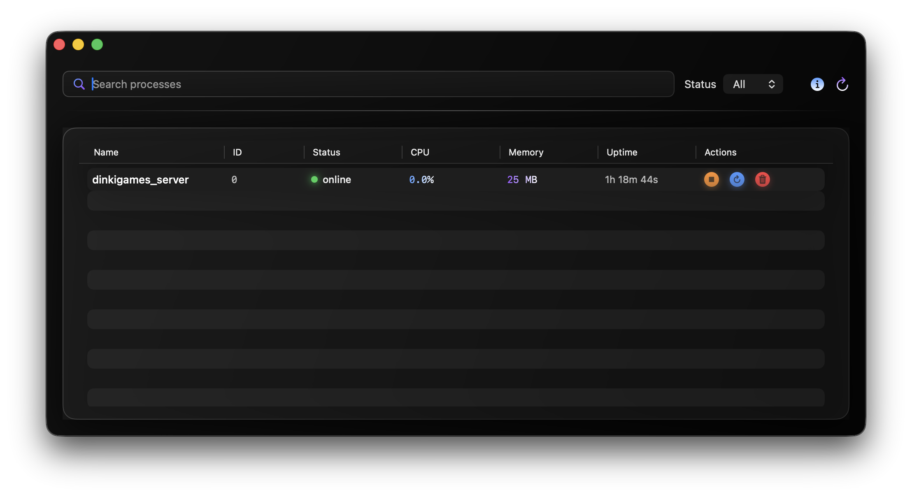
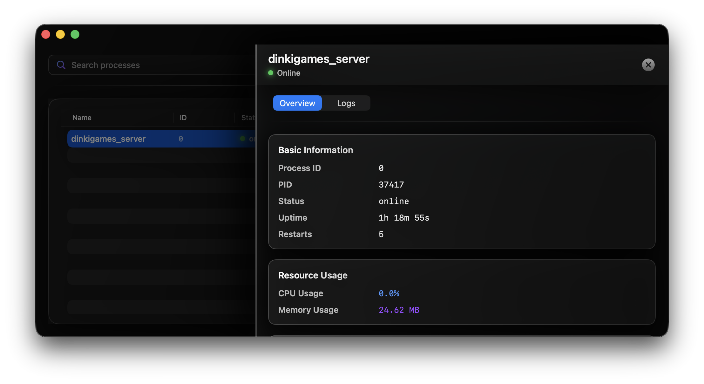

# PM2 Process Manager GUI - macOS App

A native macOS desktop application built with SwiftUI for monitoring and managing PM2-managed Node.js processes.

## Overview

### Process List

[](misc/Screenshots/PM2GUI-Process-List.png)

### Process Details

[](misc/Screenshots/PM2GUI-Process-Details.png)

## Features

- **Process Listing**

  - Displays all PM2 processes in a native macOS table
  - Shows: Name, ID, Status, CPU %, Memory (MB), Uptime
  - Auto-refresh every 3 seconds
  - Manual refresh button
  - Color-coded status indicators

- **Process Management**

  - Start/Stop/Restart/Delete actions
  - Confirmation dialogs for destructive operations
  - Real-time feedback with native alerts
  - Automatic list refresh after actions

- **Process Details**

  - NavigationSplitView with detail pane
  - **Overview Tab**: Full metadata, script path, environment variables, resource usage
  - **Logs Tab**: Real-time stdout/stderr logs in monospaced font
  - On-demand log fetching

- **Search & Filter**

  - Search processes by name (instant, client-side)
  - Filter by status (all, online, stopped, errored, etc.)
  - Native SwiftUI components

- **Error Handling**
  - Graceful handling of PM2 not installed
  - Permission error detection
  - Invalid output parsing
  - User-friendly error messages

## Architecture

Built using **MVVM** pattern with clean separation:

```
PM2GUI/
├── Models/
│   └── PM2Process.swift          # Data models
├── Services/
│   └── PM2Service.swift          # PM2 CLI interaction layer
├── ViewModels/
│   ├── ProcessListViewModel.swift    # List state management
│   └── ProcessDetailViewModel.swift  # Detail state management
└── Views/
    ├── ProcessListView.swift     # Main process table
    └── ProcessDetailView.swift   # Detail view with tabs
```

## Technical Details

- **Platform**: macOS 26.0
- **Language**: Swift 5.0
- **UI Framework**: SwiftUI
- **Process Execution**: Foundation `Process` (NSTask)
- **PM2 Interaction**: CLI commands via `pm2 jlist`, `pm2 describe`, `pm2 logs`
- **Concurrency**: Swift async/await
- **Auto-refresh**: Timer-based polling (3-second interval)

## Requirements

- macOS 26.0 or later
- Xcode 14.0 or later
- Node.js and PM2 installed on the local machine
- PM2 must be accessible in PATH

## Building & Running

1. Open `PM2GUI.xcodeproj` in Xcode
2. Select "My Mac" as the destination
3. Press ⌘R to build and run

Or build from command line:

```bash
cd PM2GUI
xcodebuild -scheme PM2GUI -destination 'platform=macOS' build
open Build/Products/Debug/PM2GUI.app
```

## How It Works

1. **PM2 Detection**: Checks if PM2 is installed before starting auto-refresh
2. **Process Discovery**: Executes `pm2 jlist` to get JSON list of processes
3. **JSON Parsing**: Decodes JSON into strongly-typed `PM2Process` models
4. **UI Updates**: SwiftUI automatically updates views via `@Published` properties
5. **Actions**: Executes `pm2 start|stop|restart|delete <id>` commands
6. **Details**: Uses process data from list (no additional PM2 calls needed)
7. **Logs**: Fetches logs via `pm2 logs <id> --lines N --nostream --raw`
8. **Timeout Protection**: All PM2 commands have a 10-second timeout to prevent hanging

## PM2 Path Configuration

The app automatically discovers PM2 by searching common installation locations:

- `/opt/homebrew/bin/pm2` (Homebrew Apple Silicon)
- `/usr/local/bin/pm2` (Homebrew Intel)
- `/usr/bin/pm2` (System installations)
- `~/.nvm/versions/node/*/bin/pm2` (NVM installations - automatically expanded)

The app uses the absolute path to PM2, ensuring it works regardless of the system PATH configuration. This makes the app fully portable when copied to different machines.

**Note**: The app properly handles stdin by redirecting it to `/dev/null` to prevent PM2 commands from hanging when waiting for input.
